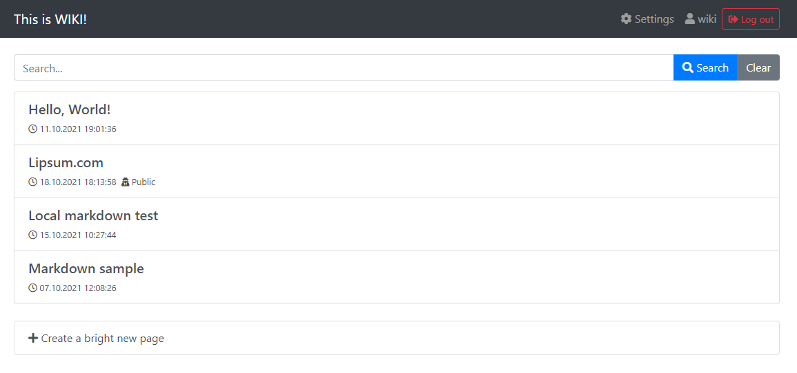

# WIKI module for is4wfw

This modules a simple WIKI-like pages. The current version offers basic operations like managing pages, writing content in markdown, searching and finally manage which pages can be access anonymously.

## Installation

Download the zip file from releases and upload it to your instance of the is4wfw. Then, create a role named "wiki" and assign in to some users. Finally, the module has a "project entrypoint", so create a new web project and assign the entrypoint.